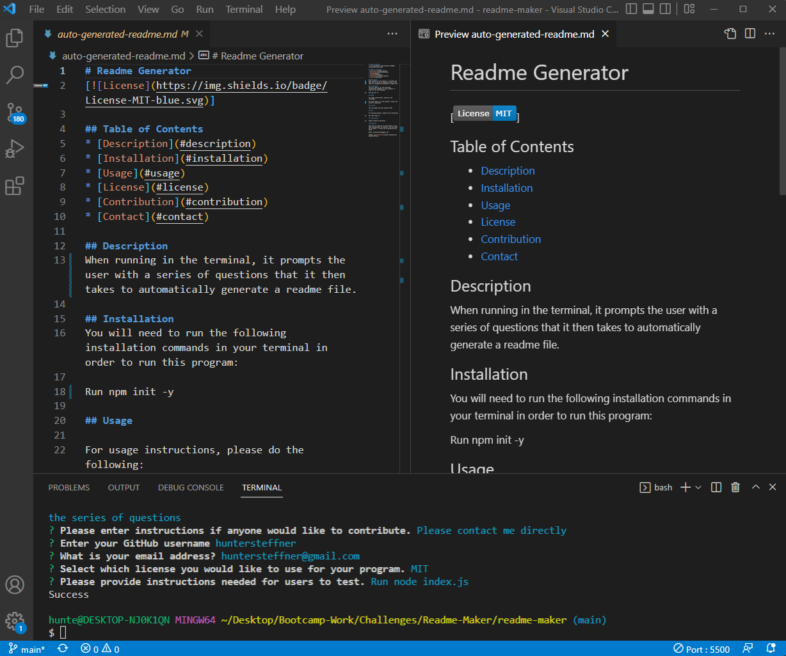

# Readme Generator

[]

## Table of Contents

- [Description](#description)
- [Installation](#installation)
- [Usage](#usage)
- [Video](#video)
- [License](#license)
- [Contribution](#contribution)
- [Contact](#contact)

## Description

This program prompts the user with a series of questions and then generates a readme file based off the answers the user inputs. This readme was actually made with this very program, and I then made a few additions.

## Installation

You will need to run the following installation commands in your terminal in order to run this program:

npm init -y

## Usage

For usage instructions, please do the following:

Enter node index.js into your terminal. You will then be prompted with a series of questions. Answer each question and it will then generate a readme file titled "auto-generated-readme.md"

Terminal Screenshot

Completed Readme

## Video

[Link to instructional video](https://huntersteffner.github.io/readme-maker/)

## License

This was made with the license of MIT

## Test

For testing purposes, please do the following:

Simply run node index.js and enter the commands to test

## Contribution

You may contact me directly. Anyone can contribute, but please provide credit to the original work.

## Questions

Feel free to reach out to me directly if you have any questions or concerns. You can reach me via email, or check out my github profile below.

Email: huntersteffner@gmail.com

GitHub: [huntersteffner](https://github.com/huntersteffner/)
